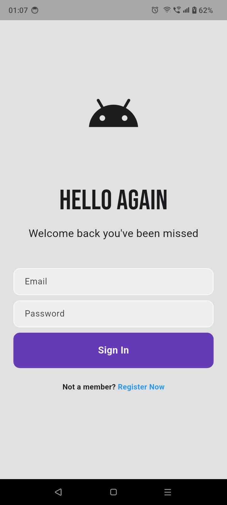

# Flutter Login UI 🔐
A clean and modern login UI built with Flutter for practice and learning purposes.

---

## 📱 Features
- Clean and minimal login screen UI  
- Email and password input fields  
- Sign in button  
- Beginner-friendly layout  

---

## 🛠️ Built With
- Flutter  
- Dart  

---

## 🚀 Getting Started
Run the project using:

```bash
flutter pub get
flutter run
```

## 📸 Preview


## 📌 Note
This is a beginner practice project focused on UI development.